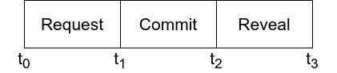
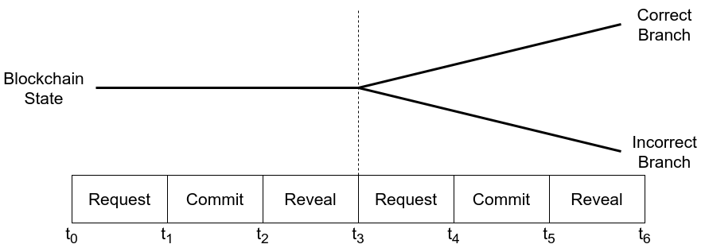
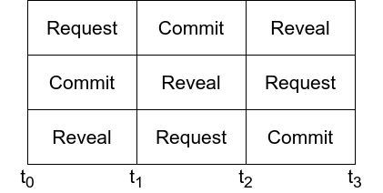

# 🛰 State Connector

The State Connector on Flare enables proving any real-world event to any contract on Flare, for example:

* Any transaction from any blockchain
* Bank transactions
* KYC / AML information
* The outcome of sporting events, etc.
* The current mining power of any miner on any blockchain
* Any existing and future API

Uniquely, the State Connector can also handle any notional value represented by the events it proves. This property of the system is achieved by automated branching of the Flare Network state to correct event outcomes, without degrading the time-to-finality or throughput metrics of the network.

## Voting Protocol

There are three phases of the State Connector voting protocol, delineated based on the current timestamp on Flare, and overlapping such that multiple sets of requests for event proofs can be worked on in parallel.

#### Request Phase

At any point in time, any user can submit a request to the State Connector contract to have an event proven. The window in time that this request enters the network state is known as the _request_ phase from its perspective.

#### Commit Phase

During the next window of time, _attestation providers_ have the opportunity to _commit_ a hidden vote regarding their belief in the outcome of the events requested in the previous phase. Anyone may operate as an attestation provider without any capital requirement, but a default incentivized set is used as the minimal requirement for passing a vote about the events in the previous set.

#### Reveal Phase

Finally in the next window of time, attestation providers _reveal_ their votes that they committed to in the previous round. Once this reveal phase concludes and the next phase begins, the revealed votes are automatically counted and all valid events become immediately available to all contracts on Flare.

## Branching Protocol

The State Connector branching protocol protects Flare against incorrect interpretation of real-world events, _proactively_, such that there are never any rollbacks on the Flare blockchain state. Instead of having rollbacks, contention on state correctness is handled via automatic state branching into a correct and incorrect path. The security assumption is that if you as an independent node operator are following along with the correct real-world state, then you will always end up on the correct branch of the blockchain state.

#### Incentivized Attestation Providers

The minimal requirement to introduce new real-world events to Flare is to pass a vote via a default set of _incentivized_ attestation providers. This set always directly mirrors the current set of Flare Time Series Oracle (FTSO) providers, creating a parallel duty in addition to their regular price provider role. For their State Connector work, they receive an additional 1% inflation per year of the network's native asset FLR, or SGB on Songbird.

#### Local Attestation Providers

Anyone may also operate their own _local_ attestation provider(s) without any capital requirement. Every Flare node operator, no matter how prominently they feature in the overall network, defines which local attestation provider(s) they wish to use for the State Connector branching protocol.

A Flare node will only pass a State Connector vote if both the incentivized set and their locally-defined set of attestation providers pass the vote:

* If a Flare node's locally-defined set of attestation providers disagrees with the vote made by the incentivized set, then:
  1. The Flare node will automatically create a backup of the blockchain state at the last point that it will have in common with the incentivized set.
  2. The Flare node will then proceed along the branch that it locally believes is correct.
* Else if the incentivized set fails to pass a vote, then:
  1. No branching occurs.

## Scalability

Below are examples of design considerations in the State Connector that make it highly scalable.

#### Overlapped Voting Protocol

Every window of time during the State Connector voting protocol is an opportunity to _request_ event proofs, meaning that while a new event is being requested, prior events can be voted on in both the commit and reveal phase. This multiplies the throughput of the state connector by a factor of three.

#### No Storage of Requests

When requests for new events are submitted to the State Connector contract, storage is not invoked. Instead, a Solidity event is emitted. This enables the total cost of the event request transaction to be below 2k gas, i.e. less than 0.1x the cost of a simple payment.

#### Merkle-Tree Root Voting

The gas usage of attestation providers is always constant, despite the number of event proof requests they handle, because they construct the valid events into a merkle tree and simply vote on the merkle tree root hash. The merkle tree algorithm can also be swapped out over time to more efficient algorithms without impacting the core State Connector voting protocol which always just votes on the root hash.

## New Event-Type Integrations

New real-world event-type integrations are introduced to the State Connector via acceptance by the incentivized attestation providers, and without requiring any changes to the core voting or branching protocols described above. This enables rapid deployment of new use-cases without any validator-level code changes.
